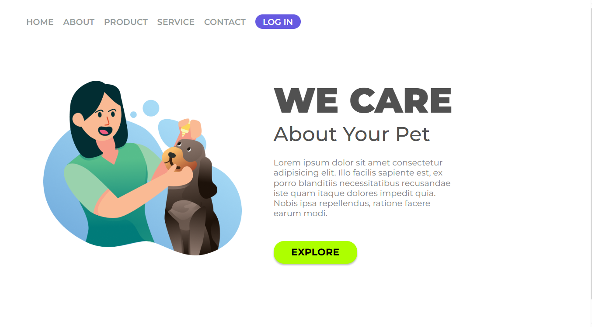
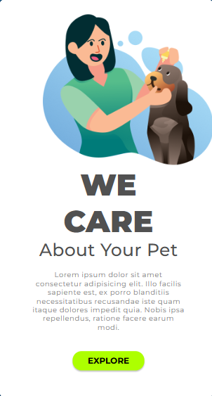

# 📌 Projeto Treinamento Site

Este repositório contém um projeto desenvolvido com foco em **aprendizado prático de desenvolvimento web**, utilizando tecnologias modernas e aplicando conceitos de **responsividade** para garantir uma boa experiência em diferentes dispositivos.

---

## 🚀 Tecnologias Utilizadas

- **HTML5** → Estrutura semântica das páginas  
- **CSS3** → Estilização e design responsivo 
- **Media Queries** → Ajustes para diferentes tamanhos de tela  

---

## 📱 Responsividade

O projeto foi construído com **design responsivo**, garantindo que funcione bem em:

- **Desktop** 🖥️  
- **Tablet** 📒  
- **Smartphone** 📱  

Exemplo de telas adaptadas:

### Tela Tablet

---
### Tela Mobile


---

## 📂 Estrutura do Projeto

```bash
├── index.html
├── style.css
├── script.js
├── image-telas/
│   ├── tela-desktop.png
│   ├── tela-tablet.png
│   └── tela-mobile.png
